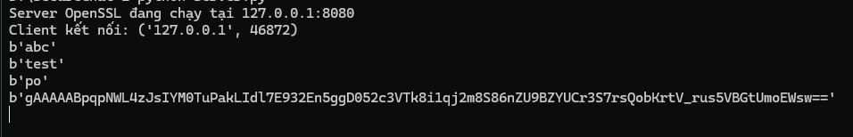

# 🔒 Secure Chat System

Hệ thống chat an toàn được viết bằng **Python**, tích hợp các cơ chế bảo mật tiêu chuẩn để đảm bảo tính Bí mật (Confidentiality), Toàn vẹn (Integrity) và Xác thực (Authentication).

## 🚀 Tính năng nổi bật

Dự án tập trung giải quyết các vấn đề bảo mật mạng cơ bản:

- **Mã hóa đường truyền (Transport Security):** Sử dụng **SSL/TLS** (Self-signed certificate) để chống nghe lén (Man-in-the-Middle).
- **Mã hóa đầu cuối (End-to-End Encryption):** Tin nhắn được mã hóa bằng **Fernet (AES)**, Server chỉ đóng vai trò trung chuyển và không thể đọc nội dung tin nhắn.
- **Xác thực mạnh (Authentication):**
  - Password được băm (Hashing) bằng **SHA-256** kết hợp với **Salt** để chống tấn công Rainbow Table.
  - Tích hợp **2FA (Two-Factor Authentication)** sử dụng TOTP (Google Authenticator).
- **Cơ sở dữ liệu:** Sử dụng SQLite để quản lý người dùng.
- **Đa luồng (Multithreading):** Server có thể xử lý nhiều Client cùng lúc.

## 🛠️ Công nghệ sử dụng

- **Language:** Python 3
- **Network:** Python Socket (TCP/IP)
- **Security Libraries:**
  - `ssl`: Tạo kết nối an toàn TLS.
  - `cryptography`: Tạo khóa và mã hóa Fernet.
  - `hashlib`: Băm mật khẩu (SHA-256).
  - `pyotp`: Tạo mã OTP và QR Code.
  - `sqlite3`: Lưu trữ dữ liệu.

## ⚙️ Cài đặt & Chạy (Installation)

### 1. Cài đặt thư viện

```bash
pip install -r requirements.txt
```

### 2. Khởi tạo Khóa & Database

Bạn cần chạy các script sau để sinh ra khóa bí mật và database

```bash
# Sinh khóa mã hóa tin nhắn (secret.key)
python GenFernet.py

# Khởi tạo database người dùng (users.db)
python init_database.py
```

_Lưu ý: Bạn cần tự tạo chứng chỉ SSL (`server.crt` và `server.key`) bằng OpenSSL và đặt vào thư mục gốc._

- Lệnh tạo chứng chỉ bằng OpenSSL

  ```powershell
  openssl req -x509 -newkey rsa:2048 -keyout server.key -out server.crt -days 365 -nodes
  ```

  - **`req`**: (Request) Lệnh yêu cầu quản lý chứng chỉ.
  - **`x509`**: Chỉ định xuất ra chứng chỉ tự ký (Self-signed) thay vì tạo một yêu cầu ký chứng chỉ (CSR) gửi lên các tổ chức CA (Certificate Authority). Phù hợp cho môi trường thử nghiệm/nội bộ.
  - **`newkey rsa:2048`**: Tạo một cặp khóa mới bằng thuật toán RSA với độ dài 2048 bit.
  - **`keyout server.key`**: Lưu cái **Chìa khóa bí mật** vào file tên là `server.key`.
  - **`out server.crt`**: Lưu cái **Chứng chỉ công khai** vào file tên là `server.crt`.
  - **`days 365`**: Chứng chỉ này có hạn sử dụng là 1 năm (365 ngày).
  - `nodes`: (No DES) Quan trọng. Tham số này yêu cầu OpenSSL **không mã hóa file Private Key**. Điều này cho phép Server khởi động tự động mà không cần quản trị viên nhập mật khẩu để mở khóa file key mỗi lần chạy.

### 3. Chạy Server

```bash
python server.py
```

### 4. Chạy Client

```bash
python client.py
```

## 📸 Demo

### 1. Khởi chạy Server

Server khởi động và lắng nghe kết nối an toàn (SSL/TLS) tại địa chỉ `127.0.0.1:8080`.


### 2. Giao diện Client

Menu chính cho phép người dùng lựa chọn Đăng ký hoặc Đăng nhập.


### 3. Đăng ký & Thiết lập 2FA

Sau khi đăng ký thành công, hệ thống trả về mã QR. Người dùng sử dụng ứng dụng **Google Authenticator** (hoặc Authy) quét mã này để lấy mã OTP 6 số.


### 4. Đăng nhập & Chat

Giao diện sau khi nhập đúng mật khẩu và mã OTP.


Tin nhắn ở phía server có thể nhìn thấy chỉ là tin nhắn mã hóa


### 💡 Hướng dẫn gửi tin nhắn
=======
### 💡 Hướng dẫn gửi tin nhắn (nhắn tin qua lại giữa các máy client)
>>>>>>> dc6deea3ba8e281998cff64e263851f231e2b7d7

Hệ thống hỗ trợ 2 chế độ gửi tin:

- **Chế độ mặc định (Chỉ TLS):** Gõ tin nhắn bình thường.
- **Chế độ E2EE (Mã hóa đầu cuối):** Thêm tiền tố `ENC:` trước tin nhắn.

**Ví dụ:**

```powershell
ENC: Hello world
```
