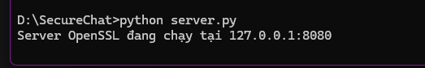
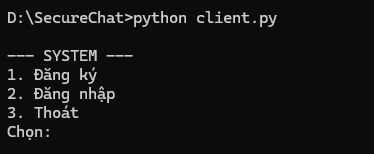
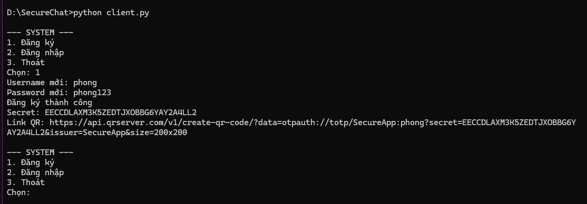
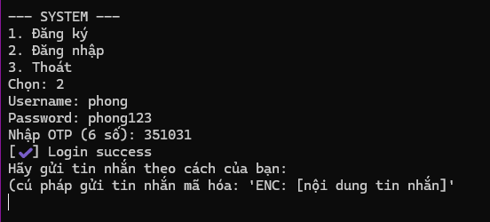
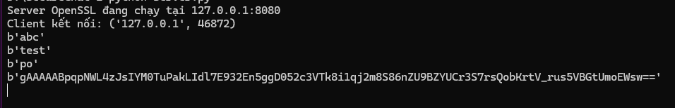
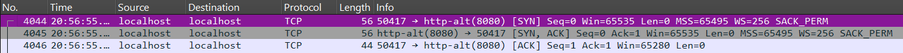
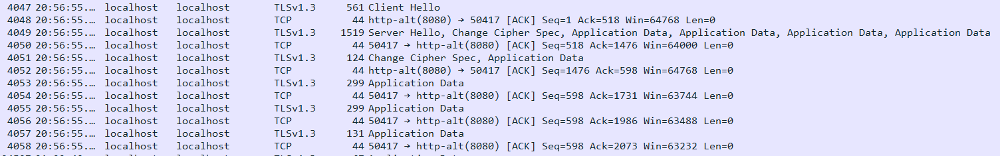
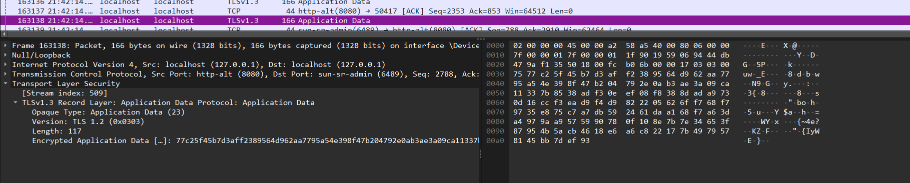

# 🔒 Secure Chat System

Hệ thống chat và gửi file an toàn được viết bằng **Python**, tích hợp các cơ chế bảo mật để đảm bảo tiêu chuẩn CIA.

## 🚀 Tính năng nổi bật

Dự án tập trung giải quyết các vấn đề bảo mật mạng cơ bản:

- **Mã hóa đường truyền:** Sử dụng **SSL/TLS** (Self-signed certificate) để chống nghe lén Man-in-the-Middle.
- **Mã hóa đầu cuối:** Tin nhắn được mã hóa bằng **Fernet**, Server chỉ đóng vai trò trung chuyển và không thể đọc nội dung tin nhắn.
- **Xác thực mạnh:**
  - Password được băm bằng **SHA-256** kết hợp với **Salt**.
  - Tích hợp **2FA** sử dụng TOTP.
- **Cơ sở dữ liệu:** Sử dụng SQLite để quản lý người dùng.
- **Đa luồng:** Server có thể xử lý nhiều Client cùng lúc.

## 🛠️ Công nghệ sử dụng

- **Language:** Python 3
- **Network:** Python Socket
- **Security Libraries:**
  - `ssl`: Tạo kết nối an toàn TLS.
  - `cryptography`: Tạo khóa và mã hóa Fernet.
  - `hashlib`: Băm mật khẩu.
  - `pyotp`: Tạo mã OTP và QR Code.
  - `sqlite3`: Lưu trữ dữ liệu.

## ⚙️ Cài đặt & Chạy

### 1. Cài đặt thư viện

```bash
pip install -r requirements.txt
```

### 2. Khởi tạo Khóa & Database

Bạn cần chạy các script sau để sinh ra khóa bí mật và database

```bash
python GenFernet.py

python init_database.py
```

### 3. Tạo chứng chỉ SSL

#### Cách 1: Chạy script tự sinh chứng chỉ

```bash
python gen_ssl_cert.py
```

#### Cách 2: Tự tạo chứng chỉ bằng OpenSSL và đặt vào thư mục gốc

- Lệnh tạo chứng chỉ bằng OpenSSL

  ```powershell
  openssl req -x509 -newkey rsa:2048 -keyout server.key -out server.crt -days 365 -nodes
  ```

  - **`req`**: (Request) Lệnh yêu cầu quản lý chứng chỉ.
  - **`x509`**: Chỉ định xuất ra chứng chỉ tự ký (Self-signed) thay vì tạo một yêu cầu ký chứng chỉ (CSR) gửi lên các tổ chức CA (Certificate Authority). Phù hợp cho môi trường thử nghiệm/nội bộ.
  - **`newkey rsa:2048`**: Tạo một cặp khóa mới bằng thuật toán RSA với độ dài 2048 bit.
  - **`keyout server.key`**: Lưu cái **Chìa khóa bí mật** vào file tên là `server.key`.
  - **`out server.crt`**: Lưu cái **Chứng chỉ công khai** vào file tên là `server.crt`.
  - **`days 365`**: Chứng chỉ này có hạn sử dụng là 1 năm (365 ngày).
  - `nodes`: (No DES) Quan trọng. Tham số này yêu cầu OpenSSL **không mã hóa file Private Key**. Điều này cho phép Server khởi động tự động mà không cần quản trị viên nhập mật khẩu để mở khóa file key mỗi lần chạy.

### 3. Chạy Server

```bash
python server.py
```

### 4. Chạy Client

```bash
python client.py
```

## 📸 Demo

### 1. Khởi chạy Server

Server khởi động và lắng nghe kết nối an toàn (SSL/TLS) tại địa chỉ `127.0.0.1:8080`.


### 2. Giao diện Client

Menu chính cho phép người dùng lựa chọn Đăng ký hoặc Đăng nhập.


### 3. Đăng ký & Thiết lập 2FA

Sau khi đăng ký thành công, hệ thống trả về mã QR. Người dùng sử dụng ứng dụng **Google Authenticator** (hoặc Authy) quét mã này để lấy mã OTP 6 số.


### 4. Đăng nhập & Chat

Giao diện sau khi nhập đúng mật khẩu và mã OTP.


Tin nhắn ở phía server có thể nhìn thấy chỉ là tin nhắn mã hóa (đối với tin nhắn E2EE)


### 💡 Hướng dẫn gửi tin nhắn (nhắn tin qua lại giữa các máy client)

Hệ thống hỗ trợ 2 chế độ gửi tin:

- **Chế độ mặc định (Chỉ TLS):** Gõ tin nhắn bình thường.
- **Chế độ E2EE (Mã hóa đầu cuối):** Thêm tiền tố `ENC:` trước tin nhắn.

**Ví dụ:**

```powershell
ENC: Hello world
```

### 💡 Hướng dẫn gửi file

Gửi file theo cú pháp: File: <đường dẫn file>

**Ví dụ:**

```powershell
File: D:\Download\file.txt
```

## 🛡️Kiểm chứng mã hóa bằng WireShark

### 1. Bắt tay TCP (TCP 3-Way Handshake)



### 2. Bắt tay bảo mật (TLS Handshake)

- Ngay sau khi kết nối thông (dòng 4046), Client bắt đầu gửi dữ liệu để thiết lập mã hóa.
  
- Gói 4047 [PSH, ACK] (Len=517): là gói **Client Hello** của giao thức TLS, gửi kèm danh sách các thuật toán mã hóa mà máy client hỗ trợ.
- Gói 4048 [ACK]: Server báo "Đã nhận được yêu cầu Client Hello".
- Gói 4049 [PSH, ACK] (Len=1475): là gói **Server Hello + Certificate**. Server gửi thuật toán mà nó sử dụng và Chứng minh thư (file server.py)
- Các gói tin tiếp theo (4051 đến 4058) là quá trình hai bên thỏa thuận (Session Key) để mã hóa cuộc hội thoại sau này.
- Các gói tin TLSv1.3 là các gói được mã hóa TLS, còn các gói TCP đan xen vào chỉ là các gói để xác nhận đã nhận được.

### 3. Nội dung gói tin

- Phần nội dung gói tin đã bị mã hóa nằm ở trường Encrypted Application Data
  
